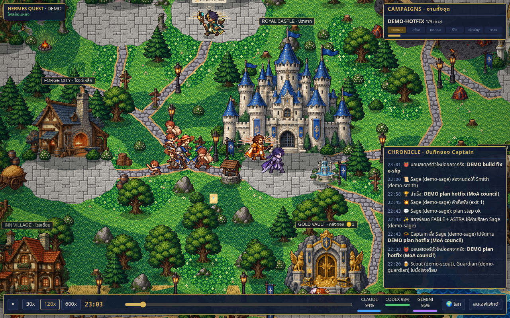
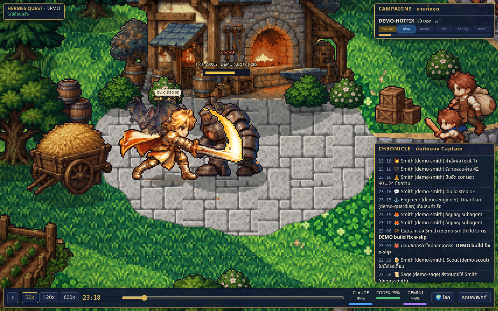
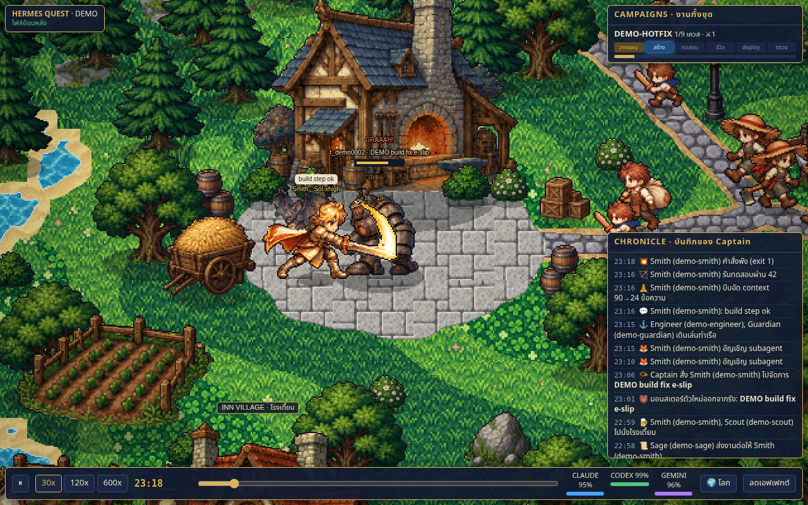
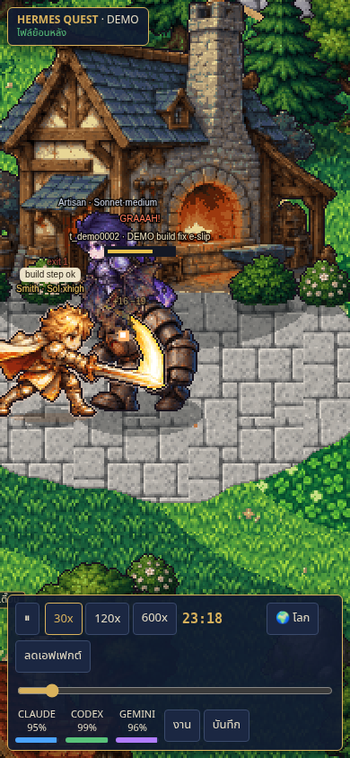
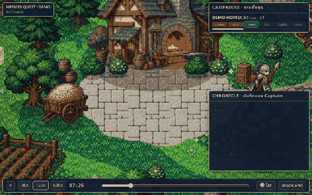

# Hermes Quest

A pixel-art fantasy RPG that turns the work of a [Hermes Agent](https://github.com/NousResearch/hermes-agent)
kanban board into a living game world. Your bots become heroes, your cards become monsters, and real activity
(patches, tests, builds, deploys) drives the fights.

<!-- screenshot: synthetic demo -->


Hermes Quest is read-only. It never writes to your Hermes data and never modifies cards. It runs either as a
standalone page with synthetic demo data or as a Hermes dashboard plugin fed by your real board.

## Features

- 21 hero sprite sheets, one per class x model combination. The class comes from the bot's role
  (warrior, ranger, paladin, engineer, mage, sage, plus the Captain as commander). The look and element come from
  the model family (Sol, Luna, Sonnet, Opus, Haiku, Gemini, and so on). Reasoning effort sets the hero's level.
- Monsters. Each card is a monster whose type follows its pipeline stage (plan, build, test, review, deploy,
  verify). It leaves a lair, waits at the war camp and marches into town when the Captain assigns a hero.
- Fights driven by activity. Patches, tests, builds and deploys are attacks. Failed commands make the monster hit
  back. Context compression makes the hero meditate. Subagents appear as familiars.
- Villagers. Porters, farmers, children and guards wander the town. They are decorative only.
- Idle heroes socialise with the bots they work with, chat and cheer completions.
- Live mode (dashboard plugin) polls for new events about every 10 seconds.
- Replay. A time bar with play/pause and 30x / 120x / 600x speeds lets you scrub the loaded window. Events
  received live are merged into the replay history, which keeps at most the latest 2,000 events; scrubbing to a
  time older than that is clamped to the oldest retained event. A LIVE button jumps back to now.
- Mobile friendly. The canvas supports drag to pan, tap to zoom into a town and tap a monster for its quest
  card. Small screens get tabbed campaign and chronicle panels.
- A "reduce effects" button turns off screen shake and flashes.

<!-- screenshot: synthetic demo -->


<!-- screenshot: synthetic demo -->


<!-- screenshot: synthetic demo -->




## Quick start: standalone demo

Requires Python 3 and any modern browser. The demo uses fully synthetic data in `data/demo.json` and needs no
Hermes installation.

```bash
git clone https://github.com/ap08960695/hermes-quest.git hermes-quest
cd hermes-quest
python3 -m http.server 0 --bind 127.0.0.1   # prints the port it picked
```

Open the printed `http://127.0.0.1:<port>/` address. To pick a fixed port use for example
`python3 -m http.server 8765 --bind 127.0.0.1`. Bind to loopback only.

Standalone always loads `data/demo.json`, even if a private replay exists. To
inspect a private local replay explicitly, use `?data=data/replay.json` or
`node tools/backtest.js --data data/replay.json`. Do not expose a directory
containing private replay files beyond loopback. The dashboard plugin instead
loads the authenticated live API and polls every 10 seconds; it does not serve
private replay files. Extraction paths and mappings are configured through
`HERMES_QUEST_CONFIG` (see `config.example.json`); titles are hidden by default.
After upgrading from older profile-ID payloads, reload the Quest tab once:
client state is memory-only, replay requests bypass cache, and a changed effective
configuration (including automatic Captain, mappings and title privacy) during
polling triggers a clean transactional snapshot without old feed/effects.

## Title privacy (`show_titles`)

`show_titles` defaults to `false`: no upstream free-form text is displayed.
Setting it to `true` is an opt-in safeguard against accidental disclosure, not
protection against adversarial text. Sensitive-label matches, source brackets
(`[` or `]`), or risky punctuation remaining after span redaction (such as `:`
or `/`) hide the entire text as `[redacted]`. Generated redaction placeholders
do not trigger the source-bracket check. Labels use
NFKD → casefold → NFKD, retaining only letters/numbers, so combining marks and
punctuation cannot split labels. Matching can span words; most real card titles
will be `[redacted]`. Ordinary titles can still display.

Non-decomposable homoglyphs (e.g. Cyrillic `а` instead of Latin `a`) are outside
this opt-in threat model. Keep the default for screenshots or shared views;
never publish live data or screenshots. See also [adapter configuration](dashboard/README.md).

To regenerate the deterministic synthetic demo: `python3 tools/mock.py`.
See [docs/configuration.md](docs/configuration.md) for extraction options.

Controls: drag to pan, mouse wheel to zoom, click a town to zoom in, click a monster for its quest card.

## Install as a Hermes dashboard plugin

The repository root is the plugin. It adds a "Hermes Quest" tab to the Hermes dashboard and registers no agent
tools or hooks. It does not open its own server. The UI bundle is included; no Quest build or pip install is needed.

### 1. Prerequisites

- Git, curl, a modern browser and a `python3` command on PATH (Python 3.12+ for the configuration/demo
  commands). On a minimal Ubuntu/Debian system install them first with
  `sudo apt-get update && sudo apt-get install -y git curl python3` (omit `sudo` when running as root).
  Hermes manages its own Python runtime; that does not necessarily publish a `python3` shell command.
  The commands below target Linux/macOS/WSL2.
- Hermes Agent with native dashboard plugin support (`hermes dashboard` and `hermes plugins enable`).
  Tested on Linux with Hermes v0.21.6+199.g1744a19 on 2026-10-09; older versions without these commands are not supported.
- Python 3.14 for the current Hermes runtime (the official installer manages it). The standalone demo and
  repository tests also run on Python 3.12. Follow the current [Hermes installation guide](https://hermes-agent.nousresearch.com/docs/getting-started/installation)
  rather than installing Hermes dependencies into system Python.

If Hermes is not installed, the official source installer supports a non-interactive dashboard-only setup:

```bash
curl -fsSL https://hermes-agent.nousresearch.com/install.sh | bash -s -- --non-interactive --skip-browser --skip-computer-use
export PATH="$HOME/.local/bin:$PATH"
hermes --version
```

The skip flags omit agent browser/computer-use tools, not the dashboard. No model key is needed just to view Quest.

### 2. Clone and enable

Use the Hermes home that runs your dashboard, not an unrelated coding-worker profile. For a named profile,
set `HERMES_HOME` to that profile's home first. Keep the whole repository layout.

```bash
export HERMES_HOME="${HERMES_HOME:-$HOME/.hermes}"
mkdir -p "$HERMES_HOME/plugins"
git clone https://github.com/ap08960695/hermes-quest.git "$HERMES_HOME/plugins/hermes-quest"
hermes plugins enable hermes-quest --no-allow-tool-override
hermes plugins list
```

If that destination already exists, do not clone over it: use the update steps below. For development, the
local-checkout symlink alternative is documented in [dashboard/README.md](dashboard/README.md).

### 3. Optional configuration and title opt-in

Without a configuration file, extraction uses `HERMES_HOME`, automatically discovers profiles/Captain and
keeps `show_titles` false. To explicitly select this same data home and safe defaults:

```bash
export HERMES_QUEST_CONFIG="$HERMES_HOME/hermes-quest.json"
python3 -c 'import json, os; from pathlib import Path; p=Path(os.environ["HERMES_QUEST_CONFIG"]); p.write_text(json.dumps({"hermes_home": os.environ["HERMES_HOME"], "profiles": "auto", "captain": "auto", "show_titles": False}, indent=2) + "\n")'
```

This creates/replaces only the Quest JSON file, not Hermes `config.yaml`. Edit this JSON to add mappings from
[`config.example.json`](config.example.json). Changing `show_titles` to `true` opts into real free text;
redaction guards accidental disclosure, not adversarial text or non-decomposable homoglyphs. Most sensitive
text becomes `[redacted]`, but ordinary real titles can remain. Do not publish live screenshots even with
redaction enabled: all README images/GIFs use synthetic data only. See [Title privacy](#title-privacy-show_titles)
and [docs/privacy.md](docs/privacy.md).

### 4. Restart the dashboard and open the tab

Stop the existing dashboard in the terminal/service that owns it, then start it with the same exported
`HERMES_HOME` and optional `HERMES_QUEST_CONFIG`. If a service manages your dashboard, set these in its
service environment and restart that service instead; exports in another shell do not reach a running service.

A fresh `127.0.0.1` dashboard uses token-only API auth on the tested Hermes build; signing in does not
make its plugin iframe work (401). Use the alternate local loopback address `127.0.0.2` below, which enables
Hermes's cookie-auth gate without binding to the LAN. Configure the host's bundled username/password
provider (or use your existing authenticated deployment); do not disable authentication.
The alternate loopback recipe was tested on Linux; on other hosts use an authenticated dashboard as
specified in the host's guide. In Bash, choose credentials without saving them in shell history:

```bash
read -r -p 'Dashboard username: ' HERMES_DASHBOARD_BASIC_AUTH_USERNAME
read -r -s -p 'Dashboard password: ' HERMES_DASHBOARD_BASIC_AUTH_PASSWORD
printf '\n'
export HERMES_DASHBOARD_BASIC_AUTH_USERNAME HERMES_DASHBOARD_BASIC_AUTH_PASSWORD
hermes dashboard --host 127.0.0.2 --port 9119 --no-open
```

Use a strong unique password. These exports apply to this process only; for persistent service credentials
follow the [Hermes dashboard authentication guide](https://hermes-agent.nousresearch.com/docs/user-guide/features/web-dashboard)
(secrets belong in the host's protected environment, never in Quest JSON or a repository).
Open `http://127.0.0.2:9119/login` and sign in with your chosen credentials, then select
"Hermes Quest" (or visit `http://127.0.0.2:9119/hermes-quest`). The first launch may build the host web UI.
An empty Hermes home shows the game world with no work/hero activity; it does not inject synthetic quests
into your live board. Try the standalone demo above for a populated example.

Keep loopback binding. For remote access use the host's documented authentication and a tunnel/VPN; do not
expose a private board through an unauthenticated server. Quest inherits the dashboard's authentication.

### Update

```bash
git -C "$HERMES_HOME/plugins/hermes-quest" pull --ff-only origin main
```

Then restart the same dashboard/service and reload the Quest tab. `--ff-only` refuses to overwrite local
commits; preserve your changes before resolving that error. A release candidate branch is not stable `main`.

### Remove

```bash
hermes plugins disable hermes-quest
```

Restart the dashboard and confirm the tab is gone. Only then remove the plugin checkout if you no longer
need it (preserve local edits first). The optional Quest JSON can also be removed; Hermes databases stay untouched.

### Troubleshooting

| Symptom | Check |
| --- | --- |
| `hermes: command not found` | Export `$HOME/.local/bin` on PATH or reload your shell after installing Hermes. |
| No Quest tab / API 404 | Check `hermes plugins list`, the checkout's `dashboard/manifest.json`, and that enable/start use the same Hermes home. Restart the actual dashboard process, then reload. |
| Tab visible but data unavailable / API 503 | Check that `HERMES_QUEST_CONFIG` is valid JSON and its `hermes_home` exists and is readable by the dashboard. Inspect host logs privately; API errors deliberately hide paths. |
| World is empty | Expected on a clean home or a window with no recent activity. Use the standalone synthetic demo to see battles. |
| Configuration has no effect | Set the variable in the dashboard/service environment and restart; shell exports do not change an existing process. |
| Port 9119 is occupied | Reuse/restart the existing dashboard or choose a free `--port` (use `0` for automatic assignment and open the printed URL). |
| Login required / iframe says `Unauthorized` | On the tested Linux build, use the authenticated `127.0.0.2` loopback recipe above, configure a host auth provider, restart and visit `/login`; `127.0.0.1` is token-only even after login. Quest does not supply or bypass credentials. |

### Read-only API

The plugin serves a small read-only API beneath `/api/plugins/hermes-quest/`, behind the dashboard's own
authentication:

| Route | Purpose |
| --- | --- |
| `GET /replay?hours=12` | Snapshot of the last N hours (0 < hours <= 168, default 12) |
| `GET /events?since=<cursor>` | Only events newer than an opaque cursor, polled about every 10 s |
| `GET /static/...` | Allow-listed game files only (`index.html`, `game.js`, `npcs.js`, `data/world.json`, sprite metadata, PNG/JSON under `assets/px/`) |

Details, limits and error behaviour are in [docs/plugin.md](docs/plugin.md).

## Configuration

Set `HERMES_QUEST_CONFIG` to the path of a JSON file. It is read by the extractor, both from the plugin and from
the command line. See [`config.example.json`](config.example.json) and [docs/configuration.md](docs/configuration.md).

```json
{
  "hermes_home": "~/.hermes",
  "profiles": "auto",
  "captain": "auto",
  "show_titles": false,
  "classes": {"developer": "warrior", "tester": "ranger", "reviewer": "paladin"},
  "regions": {"warrior": "forge", "ranger": "forest", "paladin": "citadel"}
}
```

Profiles, the Captain, profile-to-class, class-to-region, stage mappings and title display are all configurable;
nothing is tied to a particular home directory or profile name.

## Privacy

Hermes Quest is designed so the default output is safe to screenshot.

- Free text is not exported by default. Card titles, comments and bot names are replaced by generated labels
  (for example `Quest #12 · BUILD`); bot and task identifiers are hashed; model names are reduced to a family.
- Text fields come from fixed enumerations. Anything unknown becomes `unknown`.
- Memory activity is counted and shown as a gesture. The extractor projects tool identities from session
  transcripts without materializing memory query/result prose. It does not open any memory store.
- If you opt in with `"show_titles": true`, text still passes through redaction that masks URLs, IP addresses,
  absolute paths, customer or account IDs, secrets and tokens, and replaces suspicious tokens with `[redacted]`.
  Sensitive labels or residual risky punctuation hide the whole text. This guards accidental disclosure,
  not adversarial non-decomposable homoglyphs; keep the default for shared views.
- Real replay files (`data/replay.json`), `preview/` and `assets/raw/` are git-ignored. Do not publish
  screenshots made from real data.

See [docs/privacy.md](docs/privacy.md) for the full list.

## Development

```bash
python3 tools/check_public.py          # tracked-tree privacy/release gate; must print PASS
node tools/backtest.js                 # headless motion/action/social gate over data/demo.json; must print PASS
python3 -m unittest discover -s tools -p 'test_*.py'          # extractor tests (synthetic fixtures)
node dashboard/test_game.cjs && node dashboard/test_defaults.cjs   # game/live-poll/default-data tests
python3 -m unittest discover -s dashboard -p 'test_*.py'      # plugin API tests (needs fastapi and httpx)
```

Never loosen a backtest threshold to get green. Sprites and ground are generated with image tooling and converted
to pixel art by `tools/pixelize.py`. See [CONTRIBUTING.md](CONTRIBUTING.md) for the full
release gates and [docs/development.md](docs/development.md) for the asset pipeline.

## Status and limits

- Hermes Quest reads Hermes SQLite state read-only. It targets the Hermes Agent layout (`kanban.db`, per-profile
  `state.db`) and may need updates when that layout changes.
- Art was generated with AI using Codex (OpenAI image generation), then converted to pixel art. Confirm you
  are happy with the asset terms before redistributing.

## License

MIT — see [LICENSE](LICENSE).
